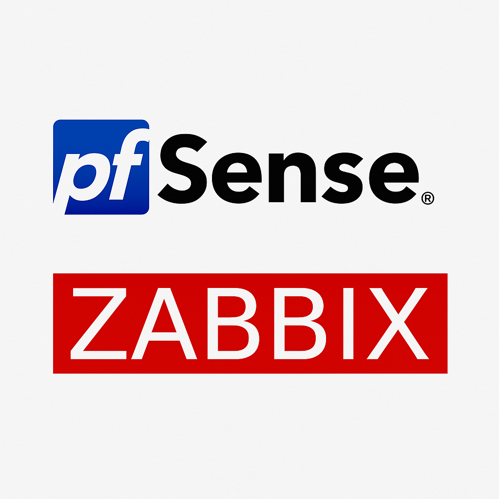
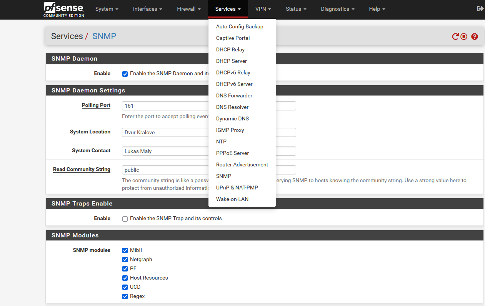
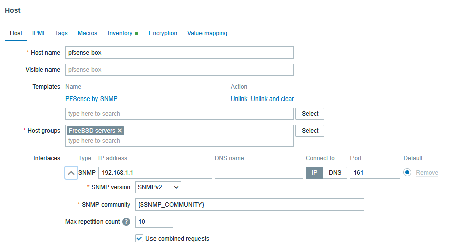

# Zabbix Appliance monitoring pfSense-box by SNMP

Independent work - Zabbix server monitoring pfSense using Vagrant for automation

Samostatná práce - Zabbix server monitorování pfsense s užitím Vagrant a automatizace



## Vagrant pfSense a monitoring SNMP pomoci Zabbix

- Zprovozněte si pfSense CE, dle Vašich stávajících znalostí
- Případně použijte Vagrant pro snadnou a rychlou instalaci pfSense ve virtualním prostredo VirtualBox
- Pomocí připravéného Vagrantfile nainstaluje pfSense CE
- Podrobná [dokumentace](https://portal.cloud.hashicorp.com/vagrant/discover/cs-c4300/pfsense) k Vagrant instalaci pfSense na stránkách portal.cloud.hashicorp.com.

### Instalace pfSense

- Vytvořte si adresář pro pfSense
- Zkopírujte do něj patřičný pfSense Vagrantfile z examples, nezapomeňte na .gitignore, který zajistí, že v projektu nebudou nechtěné soubory.
- Pomocí Vagrant vytvořte a spusťte VM s pfSense-box

### První přihlášení do Web GUI pfSense

- to access pfSense on https://localhost:8888
- Web: admin, admin
- ssh admin@localhost -p 2222
- SSH: vagrant, vagrant nebo admin, admin

```console
ssh admin@localhost -p 2222
(admin@localhost) Password for admin@pfSense.home.arpa:
VirtualBox Virtual Machine - Netgate Device ID: 57aedd694474c9c3a678

*** Welcome to pfSense 2.7.2-RELEASE (amd64) on pfSense ***

 WAN (wan)       -> em0        -> v4/DHCP4: 10.1.1.101/16
 LAN (lan)       -> vtnet1     -> v4: 192.168.1.1/24
 OPT1 (opt1)     -> vtnet0     -> v4: 10.0.2.15/24

 0) Logout (SSH only)                  9) pfTop
 1) Assign Interfaces                 10) Filter Logs
 2) Set interface(s) IP address       11) Restart webConfigurator
 3) Reset webConfigurator password    12) PHP shell + pfSense tools
 4) Reset to factory defaults         13) Update from console
 5) Reboot system                     14) Disable Secure Shell (sshd)
 6) Halt system                       15) Restore recent configuration
 7) Ping host                         16) Restart PHP-FPM
 8) Shell

Enter an option: 
```

## Rekonfigurace Zabbix appliance

- Změnte nastavení sítě VM tak, aby se Zabbix server dostal do pfSense skrze LAN interface (Vnitřní síť - intnet)
- Nastavte statickou IPv4 v Zabbix Apliance na interface eth1

## Konfigurace pfSense a test fungovani SNMP v2

- Povolte SNMP službu v nastavení pfSense menu Services / SNMP
- Nastavte Kontakt a Lokalitu
- Doinstalujte do Appliance balicek net-snmp-utils 
- Ověřte fungovaní SNMP pomocí snmpwalk ze Zabbix serveru



```console
snmpwalk -v2c -c public 192.168.1.1 system
SNMPv2-MIB::sysDescr.0 = STRING: pfSense pfSense.home.arpa 2.7.2-RELEASE FreeBSD 14.0-CURRENT amd64
SNMPv2-MIB::sysObjectID.0 = OID: SNMPv2-SMI::enterprises.12325.1.1.2.1.1
DISMAN-EVENT-MIB::sysUpTimeInstance = Timeticks: (896904) 2:29:29.04
SNMPv2-MIB::sysContact.0 = STRING: Lukas Maly
SNMPv2-MIB::sysName.0 = STRING: pfSense.home.arpa
SNMPv2-MIB::sysLocation.0 = STRING: Dvur Kralove
SNMPv2-MIB::sysServices.0 = INTEGER: 76
```

Pro práci se SNMP Vám může být nápomocný tento článek - [Firewall pfSense: monitorování pomocí Zabbix a SNMP](https://www.root.cz/clanky/firewall-pfsense-monitorovani-pomoci-zabbix-a-snmp/), kde je mnoho věcí podrobně vysvětleno.

### Odkazy na MIB soubory BEGEMOT pro pfSense

Seznam mnoha MIB souborů - [https://mibs.observium.org](https://mibs.observium.org)

- [BEGEMOT-PF-MIB](https://mibs.observium.org/mib/BEGEMOT-PF-MIB/)
- [BEGEMOT-MIB2-MIB](https://mibs.observium.org/mib/BEGEMOT-MIB2-MIB)
- [BEGEMOT-HOSTRES-MIB](https://mibs.observium.org/mib/BEGEMOT-HOSTRES-MIB)

## Monitorujte hosta pfSense



- Vytvořte hosta pfsense-box, nebo importujte
- Nastavte SNMP interface na spravnou IPv4 a port, zkontrolujte SNMP komuniktu
- Nastavte, nalinkujte šablonu - [PFSense by SNMP](https://git.zabbix.com/projects/ZBX/repos/zabbix/browse/templates/app/pfsense_snmp)
- Ověřte fungování monitoringu SNMP

# Požadované známkované úkoly

- Odlinkujte defaultní šablonu PFSense by SNMP pokud ji máte nalinkovanou.
- Vytvořte vlastní clon šablony [PFSense by SNMP](https://git.zabbix.com/projects/ZBX/repos/zabbix/browse/templates/app/pfsense_snmp) ve které budete dělat změny a nalinkujte na hosta pfsense-box.
- Vytvořte Grafy a Dashboardy v clonované sabloně např. 'Template PFSense by SNMP'. Dle vlastního uvážení.
- V šabloně proveďte hromadné přidání tagu target s hodnotou pf na ty itemy, které jsou v MIBu BEGEMOT-PF-MIB, je jich tam více jak 10.
- Takto upravenou šabonu vyexportujte v libovolném formátu (YAML, XML, JSON) a uložte do adresáře exports, který vytvoříte.
- Pomocí snmpwalk získejte výpis systémových nastavení pfSense kde v SNMPv2-MIB::sysContact.0 = STRING: skolni.email@sposdk.cz, (Váš školní email) výpis bude v textovém souboru pfsense-box.txt ve Vašem projektu.
- Vytvořte serii obrázků - snímků Zabbix GUI - Grafy pffense-box, Dashbord pfsense-box, ale i Dashbord Web GUI pfSense, Screenshoty přidejte do projektu do nějakého adresáře.
- Do textoveho souboru NetgateID.txt vložte Vaše NID, které najdete na hlavní stránce pfSense - Netgate Device ID: 57aedd694474c9c3a678
- Po dokončení a uložení všech změn do gitu, předejte do Teams URL Vašeho projektu na školním Githubu.

...
